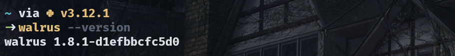
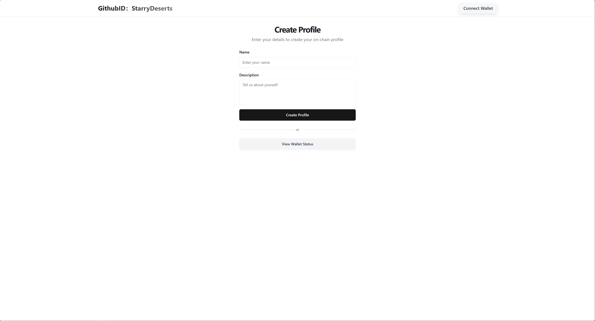

## 基本信息
- Sui钱包地址: `0xd852497c7732b882ffc3406a1186900bcdf9bcdbd82d54ab6652ea41bb1523a9`
> 首次参与需要完成第一个任务注册好钱包地址才被合并，并且后续学习奖励会打入这个地址
- github: `StarryDeserts`

## 个人简介
- 工作经验: 0 年
- 技术栈: `Java` `Move` `JavaScript` 
> 重要提示 请认真写自己的简介
- 刚毕业半年的小萌新，参加过多次sui的黑客松，包括walrus海象devnet hackthon，学习move大概快4个月了，感觉已经算勉强入门了，有写合约相关的需求欢迎找我😋。还会继续在 sui 生态一直 build 下去的
- 联系方式: tg: `@StarryDeserts`

## 任务

##   01 hello walrus
- [x] Walrus cli version:

- [x] 网站package id: `0x5e12ab8b7bf47cd86980c6358c67516793f91923c053ccfc19a49c122f687177`

- [x] 测试网NS名称: 

  虽然有一个，但是最近testnet的ns无法绑定网站的id，具体原因未知

- [x] 发布网站地址: https://2ceor6nebh9t6u8hi4hxgeonqxac2ng0th27r1rvuz5eahtt2v.walrus.site

  放个预览图在这里：

